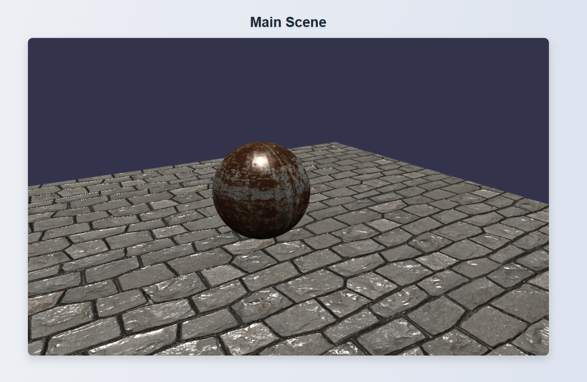

# 🏫 3D Simulation of FST Beni Mellal Campus

A web-based interactive 3D simulation of the **Faculté des Sciences et Techniques de Beni Mellal** campus, built using **Babylon.js** and **Vue.js**. This project aims to offer a realistic, navigable virtual environment of the FST campus to help students, visitors, and staff explore the university space.


---

## 📸 Preview

So far a simple textured ground with a sphere and the ability to control camera position





>"Great things are not done by impulse, but by a series of small things brought together." -Vincent van Gogh

---

## 🚀 Features

- 🧭 First-person navigation through campus buildings
- 🏢 Realistic 3D models of key areas (amphitheaters, library, administration, etc.)
- 🗺️ Interactive map with teleportation to locations
- 🏷️ Tooltips and labels for buildings and facilities
- 🌤️ Dynamic lighting and weather simulation 

---

## 🛠️ Tech Stack (so far)

| Tech           | Purpose                          |
|----------------|----------------------------------|
| [Vue.js](https://vuejs.org) | Front-end framework for UI and routing |
| [Babylon.js](https://www.babylonjs.com/) | WebGL-powered 3D rendering engine |


---

## 📁 Project Structure

```bash
simulation/
├── public/
│ ├── models/ # 3D models (GLTF/GLB)
│ └── textures/ # Textures and materials
├── src/
│ ├── components/ # Vue components (UI, loader, HUD)
│ ├── scenes/ # Babylon.js scenes and engine setup
│ └── App.vue # Root Vue component
├── static/ # Static assets like icons or logos
├── package.json
└── README.md
```

## ⚙️ Installation

```bash
# Clone the repository
git clone https://github.com/AvoCahDoe/Fst-simulation.git

# Navigate into the project directory
cd simulation

# Install dependencies
npm install

# Run the local development server
npm run dev

```


## 3D Model Notes

Models will be created using Blender and exported to .glb/.gltf format.

Ensure all assets (models, textures) are placed in the public/models/ and public/textures/ directories.
